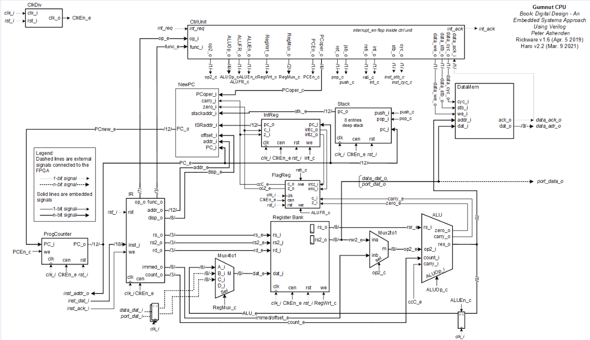
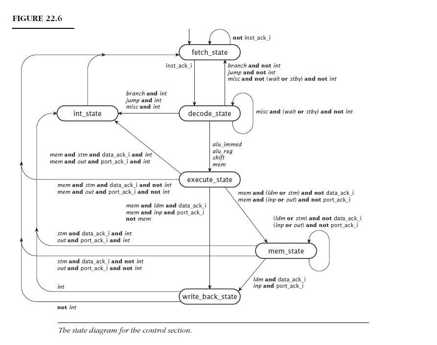

# GUMNUT

GUMNUT es un microprocesador de 8 bits usado en sistemas risc y pues hay que crearlo como otra de las brillantes ideas de intel.

# Maquina de estados del core

Importante: preguntar a Leonel que trip con todas esas señales por que pues no coinciden con las del plano.

