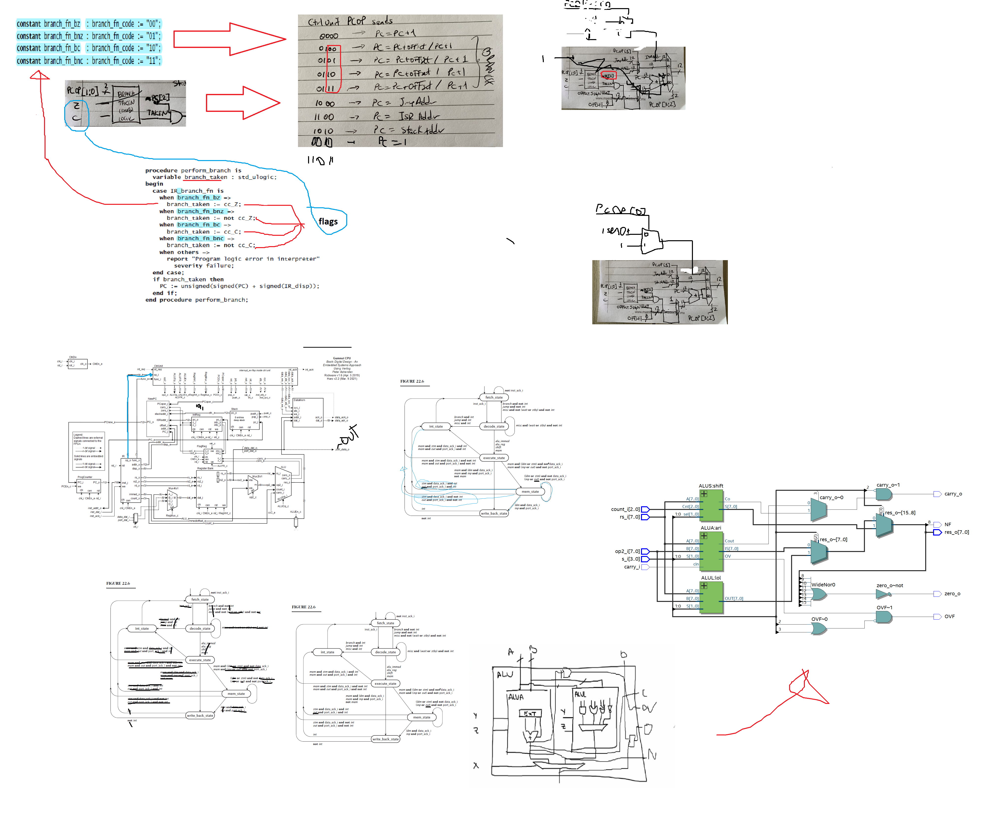

# GUMNUT
GUMNUT es un microprocesador de 8 bits usado en sistemas risc con propositos educacionales. Este repositorio implementa una version usando sintaxis de verilog. 
# La maquina de Leonel
El nombre se debe a que estabamos hablando de AI y Arturo iba a decir "maquina de turing", pero dijo "maquina de leonel" y pues queda como más hardore que Gumnut.
# Planos definitivos

# Maquina de estados del core
Importante: preguntar a Leonel que trip con todas esas señales por que pues no coinciden con las del plano.(Yafue).  

Este es un mapa de transiciones de la control unit

La logica detras del opcode de Leonel (segun yo) y algunas de nuestras disertaciones con respecto al diseño.

# Al final se llego a algo asi:

# Elon MUX:

